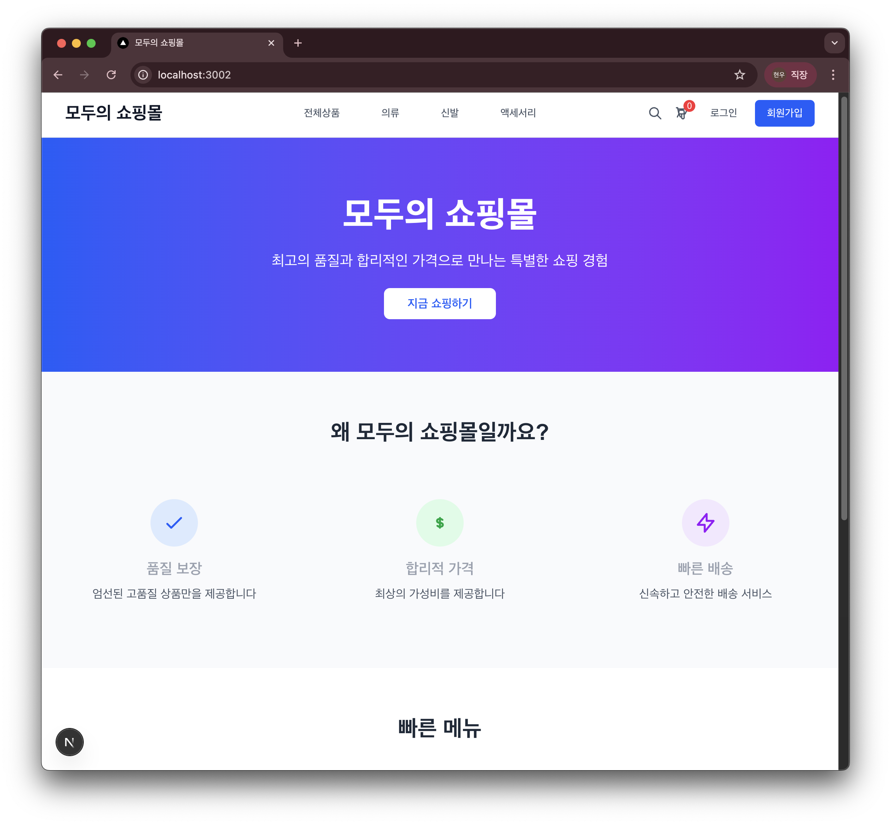
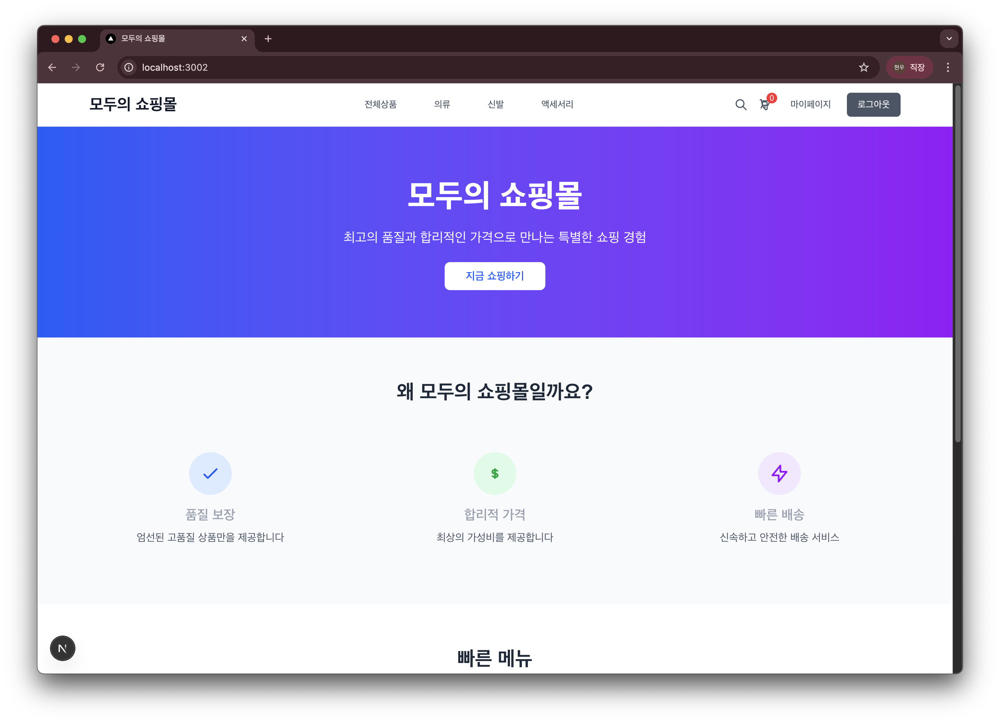
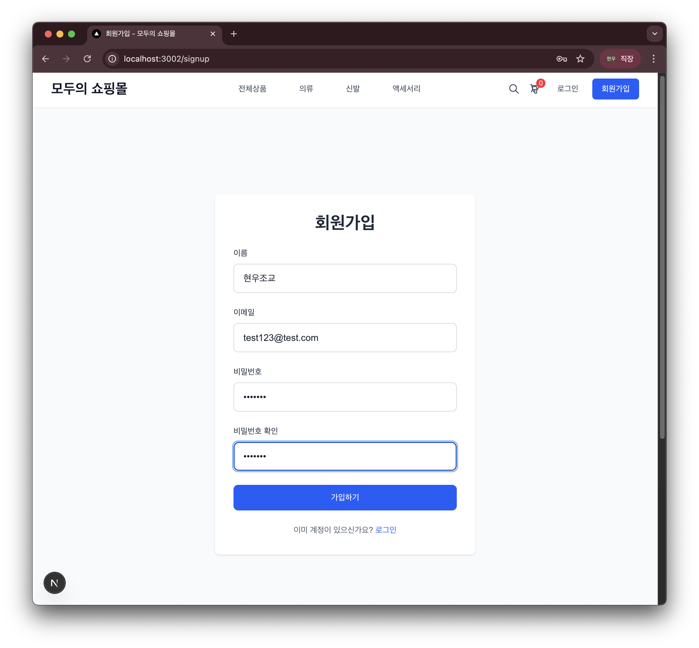
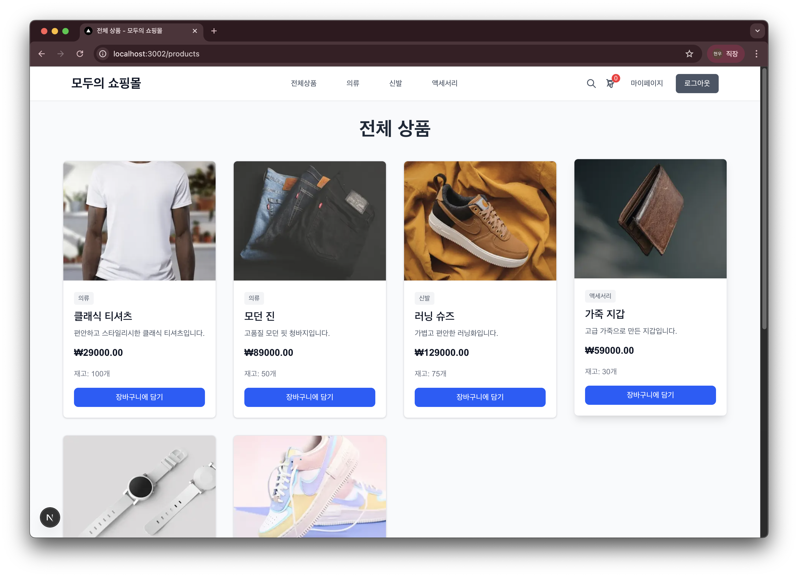
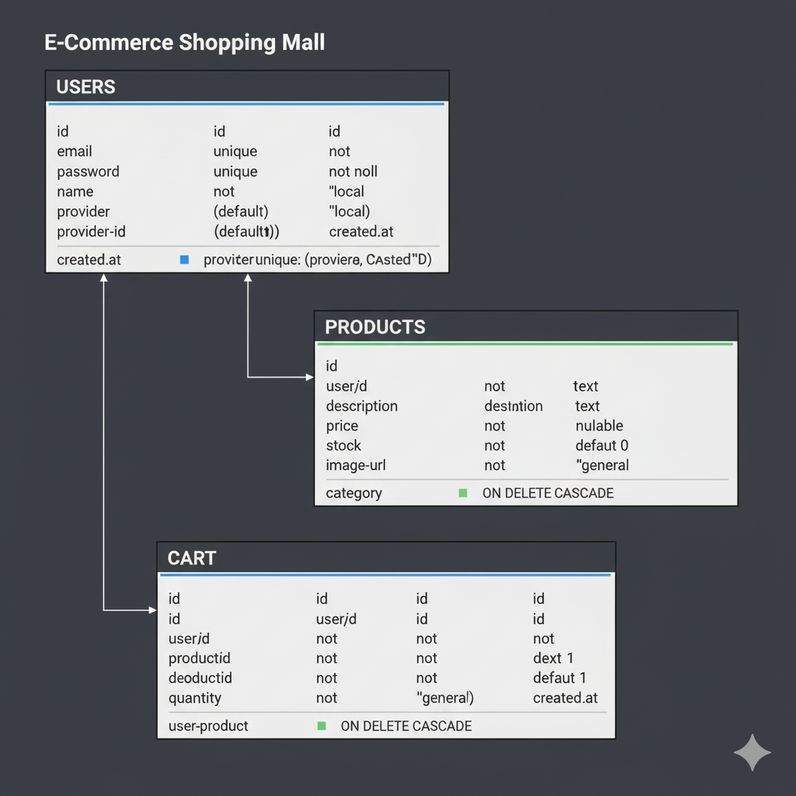

# 🛒 쇼핑몰 프로젝트

> 풀스택 쇼핑몰 웹 애플리케이션 학습 프로젝트

---

## 📸 프로젝트 미리보기

### 메인 페이지

쇼핑몰의 홈 페이지로, 최고의 품질과 합리적인 가격을 소개합니다.



### 로그인 후 메인 페이지

로그인하면 마이페이지와 로그아웃 버튼이 표시됩니다.



### 회원가입 페이지

이름, 이메일, 비밀번호를 입력하여 회원가입할 수 있습니다.



### 전체 상품 페이지

다양한 카테고리의 상품들을 한눈에 볼 수 있으며, 장바구니에 담기 버튼으로 간편하게 추가할 수 있습니다.



---

## 🛠️ 사용된 기술

### Backend


### Frontend


### 개발 도구


---

## 🚀 빠른 시작

### 1. 프로젝트 클론하기

```bash
# 이 저장소 클론
git clone [여기에_GitHub_저장소_주소_입력]
cd oz-shoppingmall
```

---

## 🔗 Git 사용법

### 자신의 GitHub에 올리기

프로젝트를 클론한 후, 자신의 GitHub 저장소로 관리하고 싶다면:

```bash
# 1. GitHub에서 새 저장소 생성 (빈 저장소로)

# 2. 원격 저장소 변경
git remote remove origin  # 기존 원격 저장소 제거 (있다면)
git remote add origin https://github.com/your-username/your-repo-name.git

# 3. 브랜치 확인 및 변경 (필요시)
git branch -M main

# 4. 푸시
git push -u origin main
```

### 브랜치 만들어서 작업하기(선택)

```bash
# 새 브랜치 생성 및 이동
git checkout -b feature/login

# 작업 후 커밋
git add .
git commit -m "로그인 기능 구현"

# 푸시
git push origin feature/login
```

### Git 관련 자주 발생하는 오류

#### `fatal: not a git repository`

```bash
# 해결: Git 초기화
git init
```

#### `fatal: remote origin already exists`

```bash
# 해결: 기존 remote 제거 후 다시 추가
git remote remove origin
git remote add origin [새로운_저장소_주소]
```

#### `error: failed to push some refs`

```bash
# 해결: 먼저 pull 받기
git pull origin main --rebase
git push origin main
```

#### Permission denied (publickey)

```bash
# 해결: SSH 키 설정 또는 HTTPS 사용
git remote set-url origin https://github.com/username/repo.git
```

---

### 2. 프로젝트 실행하기

상세한 실행 방법은 **[Howtomake.md](./Howtomake.md)** 파일을 참고하세요!

간단 요약:

```bash
# 1. 백엔드 실행
cd backend && npm install && npm run dev

# 2. 프론트엔드 실행 (새 터미널)
cd frontend && npm install && npm run dev
```

---

## 📚 학습 가이드

이 프로젝트는 **학습용 프로젝트**입니다. 완성된 코드를 그대로 실행하는 것보다, **직접 구현**하면서 배우는 것을 권장합니다.

### 🎯 학습 방법

1. **[Howtomake.md](./Howtomake.md)** 파일의 단계별 가이드를 따라 처음부터 구현
2. 힌트 주석(TODO)이 있는 파일들을 열어 직접 작성
3. 막히면 **Services 폴더**의 완성된 코드를 참고
4. 에러가 나면 오류 해결법 섹션을 확인

---

## 🔨 구현해야 할 부분 (TODO 주석 위치)

### Backend - Controllers (비즈니스 로직)

모든 함수가 **힌트 주석**만 있고 구현이 필요합니다:

#### 📄 `backend/src/controllers/authController.js`

```javascript
exports.signup = async (req, res) => {
  // TODO: 회원가입 로직을 구현하세요
  // 힌트: req.body에서 email, password, name 추출
  // 참고: authService.signup 호출
};
```

**참고할 파일**: `backend/src/services/authService.js` (완성된 코드)

#### 📄 `backend/src/controllers/productController.js`

- `createProduct` - 상품 생성
- `getProducts` - 상품 목록 조회
- `getProductById` - 특정 상품 조회
- `updateProduct` - 상품 수정
- `deleteProduct` - 상품 삭제

**참고**: `backend/src/services/productService.js`

#### 📄 `backend/src/controllers/cartController.js`

- `addToCart` - 장바구니 추가
- `getCartItems` - 장바구니 조회
- `updateCartItem` - 수량 수정
- `removeFromCart` - 상품 제거
- `clearCart` - 장바구니 비우기

**참고**: `backend/src/services/cartService.js` (상세한 주석 포함!)

#### 📄 `backend/src/controllers/userController.js`

- `getMe` - 현재 사용자 정보 조회

**참고**: `backend/src/services/userService.js`

---

### Backend - Routes (라우터 설정)

각 라우트에 **컨트롤러 함수를 연결**해야 합니다:

#### 📄 `backend/src/routes/authRoutes.js`

```javascript
// @route   POST /api/auth/signup
// @body    { email: string, password: string, name: string }
router.post("/signup"); // ← authController.signup 추가
```

**힌트**: 주석에 어떤 데이터를 보내야 하는지 명시되어 있습니다!

다른 Routes 파일도 동일한 패턴입니다.

---

### Frontend - Forms (폼 컴포넌트)

**상태 관리**와 **이벤트 핸들러**를 구현해야 합니다:

#### 📄 `frontend/src/components/forms/LoginForm.tsx`

```typescript
// TODO: 상태 관리를 위한 useState 설정
// 힌트: email, password, error, loading 필요

const handleLogin = async (e: React.FormEvent) => {
  // TODO: 로그인 핸들러 구현
  // 힌트: authApi.login() 호출
};
```

**참고**:

- `frontend/src/lib/api.ts` - API 호출 함수
- `frontend/src/lib/helpers.ts` - validation, tokenUtils

#### 📄 `frontend/src/components/forms/SignupForm.tsx`

- useState로 name, email, password, confirmPassword 관리
- handleSignup 구현

---

### Frontend - Pages (페이지 컴포넌트)

**데이터 fetching**과 **상태 관리**를 구현해야 합니다:

#### 📄 `frontend/src/components/pages/ProductsClient.tsx`

```typescript
// TODO: useState 설정 (products, loading, error)
// TODO: useEffect로 상품 데이터 로드
// 힌트: productApi.getAll() 호출
```

**참고**: `frontend/src/store/cartStore.ts` (Zustand 예시)

#### 📄 `frontend/src/components/pages/CartClient.tsx`

- useCartStore 사용법
- handleUpdateQuantity, handleRemoveItem 구현

#### 📄 `frontend/src/components/pages/MyPageClient.tsx`

- validateForm, handleUpdateProfile 구현

---

## 💡 학습 팁

### 1️⃣ Backend 학습 순서

1. **Services 먼저 읽기** → 기능 이해
2. **Controllers 구현** → Services 호출
3. **Routes 연결** → 컨트롤러 연결

### 2️⃣ Frontend 학습 순서

1. **api.ts 읽기** → API 이해
2. **Forms 구현** → 사용자 입력 처리
3. **Pages 구현** → 데이터 표시

### 3️⃣ 막혔을 때

1. 같은 폴더의 다른 파일 보기
2. Services 폴더 참고
3. Howtomake.md 확인
4. 에러 메시지 검색

---

## 📂 프로젝트 구조

```
oz-shoppingmall/
├── backend/
│   ├── src/
│   │   ├── config/         # 데이터베이스 설정
│   │   ├── controllers/    # 비즈니스 로직 (힌트 포함)
│   │   ├── routes/         # API 라우트 (힌트 포함)
│   │   ├── services/       # 데이터베이스 작업
│   │   ├── middlewares/    # 인증 미들웨어
│   │   └── index.js        # 서버 진입점
│   └── package.json
│
├── frontend/
│   ├── src/
│   │   ├── app/            # Next.js 페이지
│   │   ├── components/     # React 컴포넌트 (힌트 포함)
│   │   ├── lib/            # API 클라이언트, 유틸리티
│   │   ├── store/          # Zustand 스토어
│   │   └── styles/         # 글로벌 스타일
│   └── package.json
│
├── Howtomake.md           # 📖 상세 학습 가이드
└── README.md              # 이 파일
```

---

## 🗄️ 데이터베이스 설계 (ERD)

이 프로젝트의 데이터베이스는 **3개의 주요 테이블**로 구성되어 있습니다.



### 테이블 구조

#### 📋 USERS (사용자)

- 회원가입한 사용자 정보를 저장합니다
- `provider` 필드로 로컬 또는 소셜 로그인 구분
- 비밀번호는 bcrypt로 암호화되어 저장됩니다

#### 📦 PRODUCTS (상품)

- 쇼핑몰의 상품 정보를 저장합니다
- `user_id`로 상품을 등록한 사용자와 연결됩니다
- 카테고리별로 상품을 분류할 수 있습니다

#### 🛒 CART (장바구니)

- 사용자별 장바구니 항목을 저장합니다
- `user_id`와 `product_id`로 사용자와 상품을 연결합니다
- 사용자 또는 상품 삭제 시 자동으로 관련 장바구니 항목도 삭제됩니다 (ON DELETE CASCADE)

### 관계 설명

- **USERS ↔ PRODUCTS**: 1:N 관계 (한 사용자가 여러 상품 등록 가능)
- **USERS ↔ CART**: 1:N 관계 (한 사용자가 여러 장바구니 항목 보유)
- **PRODUCTS ↔ CART**: 1:N 관계 (한 상품이 여러 사용자의 장바구니에 담김)

---

## 📝 환경 변수 템플릿

### backend/.env

```env
PORT=3001
DB_HOST=localhost
DB_USER=root
DB_PASSWORD=your_mysql_password
DB_NAME=shopping_mall
JWT_SECRET=your_super_secret_jwt_key_change_this_in_production
```

### 주의사항

- ⚠️ `.env` 파일은 절대 Git에 올리지 마세요!
- ⚠️ JWT_SECRET은 랜덤한 긴 문자열로 변경하세요
- ⚠️ 실제 운영 환경에서는 더 강력한 보안 설정이 필요합니다

---

## 💡 학습 목표

이 프로젝트를 통해 다음을 학습할 수 있습니다:

1. **Backend**: Express.js로 RESTful API 만들기
2. **Database**: MySQL 데이터베이스 설계 및 쿼리
3. **Authentication**: JWT 기반 인증 시스템
4. **Frontend**: Next.js와 TypeScript로 모던 웹 개발
5. **State Management**: Zustand로 상태 관리
6. **API Integration**: Frontend-Backend 통신
7. **Git**: 버전 관리 및 협업

---

## 📖 참고 문서

- [Howtomake.md](./Howtomake.md) - 상세한 단계별 구현 가이드
- [Express.js 공식 문서](https://expressjs.com/)
- [Next.js 공식 문서](https://nextjs.org/docs)
- [MySQL 공식 문서](https://dev.mysql.com/doc/)
- [Tailwind CSS 공식 문서](https://tailwindcss.com/docs)

---

## 🤝 기여하기

이 프로젝트는 학습용 프로젝트입니다. 개선 사항이나 버그를 발견하면:

1. Issue를 생성해주세요
2. Fork 후 수정하여 Pull Request를 보내주세요

---

## 📄 라이선스

이 프로젝트는 학습 목적으로 자유롭게 사용할 수 있습니다.

---

**🎓 행복한 코딩 되세요! 화이팅! 🚀**
